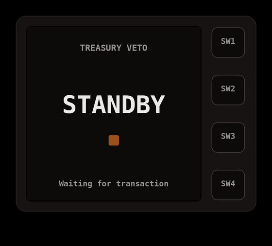

# Autonomous Treasury Agent — Firefly Hardware Veto on XRPL

**SwissHacks 2026 · Ripple — Future of Finance on XRPL: Payments, Credit & Agent Financial Infrastructure**

A treasury agent that runs corporate cross-border payments on XRPL. Small,
low-risk payments settle autonomously in seconds. Large or compliance-flagged
payments are **locked on-chain** and can only be released by a physical **Firefly
hardware approval**. The LLM orchestrates and narrates; **deterministic code
enforces policy and signing** — the AI is never trusted with money.

> "The AI decides nothing about money — code does. The AI explains. And no one,
> including the agent, can move a large payment without the device in hand."

See [`docs/PLAN.md`](docs/PLAN.md) for the full plan, [`challenge.md`](challenge.md)
for the brief, [`docs/architecture.md`](docs/architecture.md) for the design, and
[`AGENTS.md`](AGENTS.md) for the tool/agent spec. [`CLAUDE.md`](CLAUDE.md) holds
the conventions — including the one rule: the LLM never decides policy or signs.

## System Overview

### Architecture
<picture>
  <source media="(prefers-color-scheme: dark)" srcset="./diagrams/architecture-simplified-dark.svg">
  <source media="(prefers-color-scheme: light)" srcset="./diagrams/architecture-simplified-light.svg">
  
</picture>

### Infrastructure
<picture>
  <source media="(prefers-color-scheme: dark)" srcset="./diagrams/infrastructure-simplified-dark.svg">
  <source media="(prefers-color-scheme: light)" srcset="./diagrams/infrastructure-simplified-light.svg">
  
</picture>

[More diagrams →](./diagrams/README.md)

## Repository layout

```
apps/
  api/              Python FastAPI backend (Railway service)
  web/              React + Vite dashboard (Railway service)
  firefly-bridge/   Local-only Node bridge to the Firefly device
packages/
  shared/           Shared TypeScript types (web + bridge)
docs/               Plan, architecture, demo script, judging map, verification
```

The project targets the challenge's **Agent Financial Infrastructure** pillar,
using a **Payments & FX** treasury workflow as the proof. It demonstrates real
autonomous on-chain activity within institutional guardrails: deterministic
policy, compliance screening, credentials, audit evidence, and cryptographic
human approval. XLS-65/XLS-66 treasury yield is an optional Devnet extension.

The Python API is its own service with its own venv. The TS packages (`web`,
`firefly-bridge`, `shared`) are an npm workspace.

## Quick start

```bash
# 1. Install JS workspaces
npm install

# 2. Configure env
cp .env.example .env
npm run keygen --workspace apps/firefly-bridge   # paste the two keys into .env

# 3. Backend (separate terminal)
cd apps/api && python -m venv .venv && . .venv/Scripts/activate \
  && pip install -r requirements.txt && uvicorn app.main:app --reload

# 4. Dashboard + bridge (from repo root)
npm run dev:web
npm run dev:bridge
```

The API defaults to `USE_MOCK_XRPL=true`, so the full flow — auto-settle, lock,
hardware approve, release — runs offline with deterministic fake tx hashes. Flip
it off and supply funded testnet wallet seeds to hit XRPL testnet for real.

## The demo

A $500 invoice auto-settles. A $50,000 invoice locks on-chain and waits. Pick up
the Firefly, press the button, the signature verifies, the escrow releases. Both
transactions are live on testnet with explorer links, every decision explained in
plain language. Full script in [`docs/demo-script.md`](docs/demo-script.md).

### Demo

[](pixie_treasury_veto.mp4)

The submission also includes public documentation, a demo video, explicit XRPL
feature/amendment mapping, a maximum-10-slide deck, and a 5–10 minute live pitch
and demo followed by 3 minutes of Q&A, as required by [`challenge.md`](challenge.md).

## Deployment

Two Railway services (API via `apps/api/Dockerfile`, web via `apps/web/Dockerfile`
with the repo root as build context) plus a Postgres plugin. The Firefly bridge
is **never** deployed — it runs on the operator's laptop next to the hardware.
