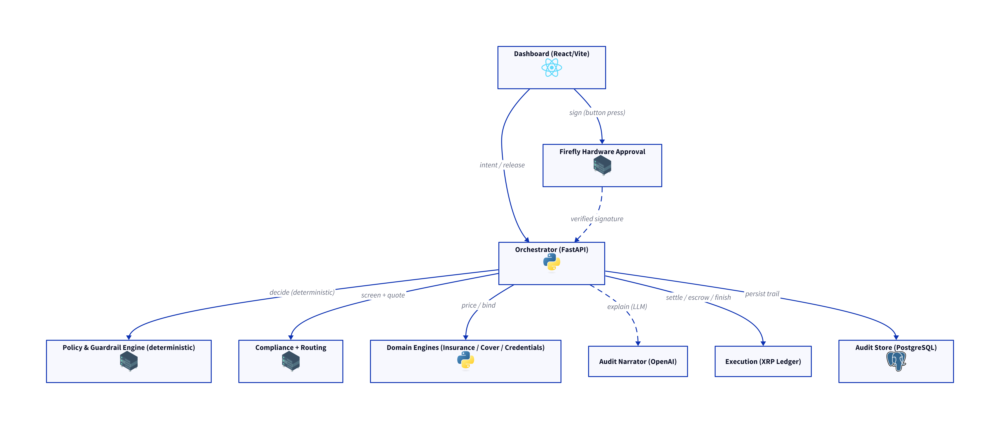
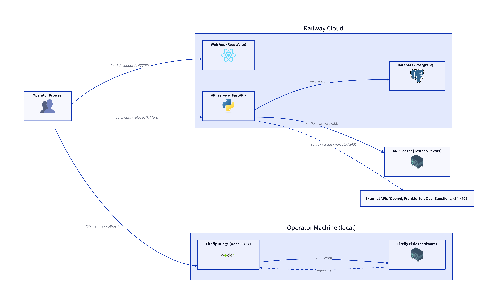

# VaultGuard — AI Agent Insurance Protocol on XRPL

**SwissHacks 2026 · Ripple — Future of Finance on XRPL: Payments, Credit & Agent Financial Infrastructure**

> "The AI decides nothing about money — code does. The AI explains. And no one, including the agent, can move a large payment without the device in hand."

[](pixie_treasury_veto.mp4)

**[Live demo →](https://web-production-b7318.up.railway.app/)**

---

## The Challenge

**Future of Finance on XRPL: Payments, Credit & Agent Financial Infrastructure**

Institutional financial services remain trapped in legacy infrastructure — fragmented, slow, and costly. While AI agents are emerging to automate complex financial workflows, the financial infrastructure they need to operate autonomously in institutional environments doesn't yet exist: no verified identity, no spending controls, no compliant settlement, no governed sub-agents.

Ripple's challenge asks teams to build a working prototype that addresses a genuine institutional pain point across three pillars:

- **Payments & FX** — cross-border settlement, B2B invoice logic, treasury tools
- **Credit & Lending** — trade finance, on-chain collateral, supply chain finance (XLS-65/66)
- **Agent Financial Infrastructure** — Know Your Agent (KYA), wallet spending policies, compliance-gated autonomous payments, agent-to-agent delegation

VaultGuard targets **Agent Financial Infrastructure** with a live **Payments & FX** treasury workflow as proof.

---

## The Problem

**AI agents are moving money. Nobody's insuring the mistakes.**

- $67.4B lost to enterprise AI hallucinations globally in 2024
- $2.3B in avoidable finance losses from AI errors in Q1 2026 alone
- Average cost per incident: **$4.4M per company**
- Finance teams using AI agents jumped from 7% → 44% in 14 months
- The insurance industry's response: Berkshire, Chubb, and Travelers are *excluding* AI liability from standard policies

Three failure modes nobody covers today:

1. **Hallucinated amounts** — agent sends $500 when instructed $5,000
2. **Wrong recipient** — agent fabricates or misreads a destination address
3. **Non-delivery** — payment confirmed, goods never arrived

---

## The Solution

**An autonomous treasury agent that settles cross-border payments in seconds — and insures its own mistakes on-chain.**

| Feature | What it means for a CFO |
|---|---|
| Autonomous payment routing | $500 vendor invoice settled in 4 seconds, no human in the loop |
| Hardware veto | No one *can* bypass approval for payments over $10K — physically enforced |
| Parametric cover policy | Treasury buys insurance against agent errors, priced by risk score |
| Automatic claim trigger | Divergence detected → payout in seconds, no claims adjuster |

**Savings vs. traditional cross-border wire transfers:**

| | Traditional Wire | VaultGuard |
|---|---|---|
| Settlement time | 2–5 days | ~4 seconds |
| Fee | $25–50 + 1–3% FX spread | Near-zero, RLUSD eliminates FX spread |
| AI liability coverage | Explicitly excluded | Parametric, on-chain, automatic |

For a $50M/year treasury: **estimated $500K–1.5M in annual savings**, plus the first coverage that actually pays when the AI makes a mistake.

**Competitive position:** Only one competitor exists at prototype stage (Klaimee, YC 2026). They cover general AI deployment errors. We cover the specific financial transaction layer, on-chain, parametrically, on XRPL.

---

## Three-Layer Architecture

```
┌─────────────────────────────────────────────┐
│  LAYER 3: INSURANCE                         │
│  Parametric cover policies priced per agent │
│  · Hallucination line (wrong amount/address)│
│  · Non-delivery line                        │
│  · Automatic trigger, payout in seconds     │
├─────────────────────────────────────────────┤
│  LAYER 2: GOVERNANCE                        │
│  Policy engine (code, not AI)               │
│  · Spending limits enforced deterministically│
│  · Firefly hardware veto for large payments │
│  · Sanctions hard-block (no override)       │
├─────────────────────────────────────────────┤
│  LAYER 1: PAYMENT RAILS                     │
│  XRPL + RLUSD                               │
│  · Settle in seconds, not days              │
│  · TokenEscrow (XLS-85) locks funds on-chain│
│  · KYA Credentials (XLS-70) for agent identity│
└─────────────────────────────────────────────┘
```

**The core invariant:** The LLM orchestrates and narrates. It never decides policy, signs transactions, or approves claims. Those are deterministic code.

---

## Three Payment Flows

**Flow 1 — Small payment (auto-settle):**
> Invoice arrives → agent routes via XRPL pathfinding, screens for sanctions, settles in RLUSD → explorer link in ~4 seconds → audit log written in plain English

**Flow 2 — Large payment (hardware veto):**
> $50K invoice arrives → policy engine flags over-threshold → funds locked on-chain via TokenEscrow → Firefly device lights up with payment details → operator presses physical button → secp256k1 signature verified by backend → EscrowFinish submitted → settled

**Flow 3 — Cover claim (parametric payout):**
> Agent sends wrong amount → reconciliation engine compares expected vs. executed → cover pool pays shortfall directly to merchant → LLM narrates what happened in plain English, no adjuster involved

---

## XRPL Features

| Feature | Standard | Status | How we use it |
|---|---|---|---|
| TokenEscrow | XLS-85 | Mainnet / Testnet | Locks RLUSD on-chain for large payments pending hardware approval |
| Credentials (KYA) | XLS-70 | Mainnet / Testnet | Know Your Agent identity — agent wallet must hold a valid KYC credential to auto-settle |
| RLUSD | — | Mainnet / Testnet | Stable settlement asset across all flows |
| Pathfinding | — | Mainnet / Testnet | FX routing for optimal RLUSD quotes |
| Single Asset Vault | XLS-65 | Devnet | Optional: idle treasury sweep for yield (extension, disabled by default) |

**Why TokenEscrow over standard XRP escrow:** We need to lock RLUSD, which is an IOU. Classic XRP escrow only works for XRP. XLS-85 activated on mainnet February 2026 and extends escrow to IOUs and MPTokens — no other public ledger has this primitive live today.

**Why XRPL Credentials for KYA:** Before an agent wallet can auto-settle payments, it must hold an accepted KYC credential issued by our credential issuer wallet. Absent or expired credential → payment escalates regardless of amount. This gives institutions an auditable identity chain for every autonomous payment.

---

## System Diagrams

### Architecture

The system has three deployable units. The **React dashboard** (`apps/web`) is the operator's window into every workspace — payments, treasury, agent cover, credentials, and the demo lab. It talks exclusively to the **FastAPI orchestrator** (`apps/api`) over HTTP. The orchestrator runs each workflow as a fixed sequence of deterministic tool calls:

1. **Routing** — quotes an FX path and normalises the amount to USD (Frankfurter)
2. **Compliance** — screens the counterparty for sanctions (OpenSanctions/Plaid) and produces an AML score
3. **Policy & Guardrail Engine** — the deterministic boundary that decides `settle / escalate / block` from a USD threshold + AML score, running the G1–G7 guardrail chain; the LLM never reaches past this layer
4. **Domain engines** — insurance actuarial pricing, agent cover, XLS-70 KYA credential issuance, each called deterministically
5. **Audit Narrator** — the only LLM call (OpenAI gpt-4o); turns the already-decided trail into plain English; an Ed25519 hash-chained event log anchors every decision
6. **Execution** — submits `Payment` (auto-settle), `EscrowCreate` (lock), or `EscrowFinish` (release) to XRPL via `xrpl-py`
7. **Audit Store** — append-only Postgres decision trail for every payment and agent action

To release a locked payment, the browser fetches a sha256 approval challenge from the API, sends it to the **local Firefly bridge** (`apps/firefly-bridge`, never deployed), which forwards it to the Firefly device over USB. The operator presses the physical button; the device returns a secp256k1 signature. The browser posts that signature to the API, which verifies it before calling `EscrowFinish`. If the signature fails — wrong amount, wrong recipient, replayed — the API returns 403 and the funds stay locked.

<picture>
  <source media="(prefers-color-scheme: dark)" srcset="./diagrams/architecture-simplified-dark.png">
  <source media="(prefers-color-scheme: light)" srcset="./diagrams/architecture-simplified-light.png">
  
</picture>

<details>
<summary>Detailed architecture diagram</summary>

<picture>
  <source media="(prefers-color-scheme: dark)" srcset="./diagrams/architecture-dark.svg">
  <source media="(prefers-color-scheme: light)" srcset="./diagrams/architecture-light.svg">
  
</picture>

</details>

### Infrastructure

Two Railway services and a local-only bridge form the deployment boundary. The **API service** (`apps/api`, Python/FastAPI) and **web service** (`apps/web`, React/Vite) run as containers on Railway, backed by a **Railway PostgreSQL** database (~17 tables) that holds the full append-only decision trail. The web service is a static Vite build; the API is the deterministic orchestrator, policy engine, XRPL client, and audit store.

The **Firefly bridge** (`apps/firefly-bridge`) never reaches the cloud — it runs on the operator's laptop on port 4747 and owns the USB/serial connection to the Firefly Pixie device. The browser calls it directly over localhost for the signing step, so the hardware key never touches Railway.

External connections from the API:
- **XRPL Testnet/Devnet** over WebSocket (`xrpl-py`) — settlement, escrow, credentials
- **OpenAI** — narration only (gpt-4o)
- **Frankfurter** — FX rates for USD normalisation
- **OpenSanctions / Plaid** — AML and sanctions screening
- **t54 x402 facilitator** — agent pay-at-need settlement for HTTP 402 services

<picture>
  <source media="(prefers-color-scheme: dark)" srcset="./diagrams/infrastructure-simplified-dark.png">
  <source media="(prefers-color-scheme: light)" srcset="./diagrams/infrastructure-simplified-light.png">
  
</picture>

<details>
<summary>Detailed infrastructure diagram</summary>

<picture>
  <source media="(prefers-color-scheme: dark)" srcset="./diagrams/infrastructure-dark.svg">
  <source media="(prefers-color-scheme: light)" srcset="./diagrams/infrastructure-light.svg">
  
</picture>

</details>

[All diagrams →](./diagrams/README.md)

---

## The Wow Feature: "The button that can't be faked"

**Live demo — $50,000 invoice:**

1. Agent routes via XRPL pathfinding — RLUSD quote in <1s
2. Compliance engine scores AML at 12/100 — clears sanctions
3. Policy engine fires: amount > $10K threshold → **escalate**
4. Funds locked on-chain via TokenEscrow — nobody can touch them
5. Firefly device lights up with payment details on screen
6. Operator presses the **physical button**
7. secp256k1 signature travels browser → local bridge → API
8. Backend verifies signature against registered public key
9. EscrowFinish submitted → settled in seconds
10. XRPL testnet explorer — both transactions live on-chain

**Then: tamper proof.** Try to approve a modified amount. The signature fails. Funds stay locked. API returns 403. The signature is cryptographically bound to the exact payment details — it cannot be replayed against a different amount or recipient.

---

## Why It's the Best Solution

| Capability | VaultGuard | Traditional insurers | Nexus Mutual / Etherisc | Klaimee (YC 2026) |
|---|:---:|:---:|:---:|:---:|
| Covers AI financial hallucinations | ✅ | ❌ excluded | ❌ not focused | ✅ general only |
| On-chain parametric trigger | ✅ | ❌ | ✅ DeFi only | ❌ |
| Priced per agent, per risk band | ✅ | ❌ | ❌ | ❌ |
| Hardware veto on large payments | ✅ | n/a | n/a | n/a |
| Institutional dashboard + audit | ✅ | n/a | n/a | ❌ |
| Runs on XRPL + RLUSD | ✅ | ❌ | ❌ | ❌ |

**Regulatory tailwind:** EU AI Act enforcement starts August 2026. Organizational liability for AI decisions is mandatory. Our cover policy is the compliance answer legal teams need before they can approve AI in the payment flow.

---

## Business Model

**Target customer:** Corporate treasury teams at mid-market companies ($50M–$5B revenue) evaluating or already using AI payment automation.

**Revenue streams:**
- **Cover premium** — % of insured amount × risk band × term, priced on-chain, paid in RLUSD
- **SaaS subscription** — treasury dashboard + governance layer
- **Per-agent onboarding fee** — KYA credential issuance and risk scoring

**Path to Mainnet (three config swaps, architecture unchanged):**
1. Testnet endpoint → Mainnet XRPL endpoint
2. Mock RLUSD issuer → real Ripple RLUSD issuer
3. Mock compliance → real sanctions provider (Elliptic, Chainalysis)
4. Local Firefly bridge → HSM/custody signer (adapter interface already abstracted)

---

## Repository Layout

```
apps/
  api/              Python FastAPI backend (Railway service)
  web/              React + Vite dashboard (Railway service)
  firefly-bridge/   Local-only Node bridge to the Firefly device
packages/
  shared/           Shared TypeScript types (web + bridge)
docs/               Plan, architecture, demo script, judging map, verification
diagrams/           D2 source + rendered SVG/PNG diagrams (light + dark)
```

**Two Railway services** (API + web) plus Postgres. The Firefly bridge is **never deployed** — it runs on the operator's laptop next to the hardware.

---

## Quick Start

```bash
# 1. Install JS workspaces
npm install

# 2. Configure env
cp .env.example .env
npm run keygen --workspace apps/firefly-bridge   # paste the two keys into .env

# 3. Backend (separate terminal)
cd apps/api && python -m venv .venv && . .venv/Scripts/activate \
  && pip install -r requirements.txt && uvicorn app.main:app --reload

# 4. Dashboard + bridge (from repo root)
npm run dev:web
npm run dev:bridge
```

The API defaults to `USE_MOCK_XRPL=true` — the full flow (auto-settle, lock, hardware approve, release) runs offline with deterministic fake tx hashes. Flip it off and supply funded testnet wallet seeds to hit XRPL testnet live.

---

## Tech Stack

- **Backend:** Python 3.11+, FastAPI, SQLAlchemy (async), Pydantic, `xrpl-py`, OpenAI SDK
- **Frontend:** TypeScript, React 18, Vite
- **Bridge:** TypeScript, Node 20, Express, `serialport`
- **Database:** PostgreSQL (full decision audit trail)
- **Hardware:** Firefly ESP32-C3 (secp256k1 signing, physical button veto)
- **Settlement:** XRPL Testnet, RLUSD, TokenEscrow (XLS-85), Credentials (XLS-70)

---

## Team Blaiko

| Name | Role |
|---|---|
| Sergiu Nica | AI Engineer — Allianz, Generali, Škoda Auto |
| Gaspar Palma Astorga | AI Analyst — Financial/Legal, Škoda Auto |
| Andrej Betak | Data Engineer & HW Engineer — Škoda Auto |

---

## Further Reading

- [`docs/architecture.md`](docs/architecture.md) — full system design and trust boundaries
- [`docs/demo-script.md`](docs/demo-script.md) — step-by-step demo guide
- [`docs/pitch-deck.md`](docs/pitch-deck.md) — pitch deck content and judge Q&A prep
- [`challenge.md`](challenge.md) — original challenge brief
- [`AGENTS.md`](AGENTS.md) — orchestration and tool contracts
- [`CLAUDE.md`](CLAUDE.md) — repository conventions and the one rule
